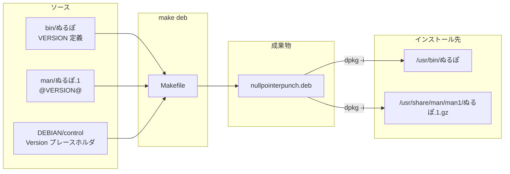

# NullPointerExceptionPunch 仕様書

## 1. 概要

| 項目 | 内容 |
|------|------|
| プロジェクト名 | NullPointerExceptionPunch |
| パッケージ名 | `nullpointerpunch`（Debian） |
| コマンド名 | `ぬるぽ` |
| 目的 | ターミナル上で「ガッ（ｶﾞｯ）」を再現するジョーク CLI |
| ライセンス | MIT |
| 対象 OS | Debian/Ubuntu 系（`.deb` 配布） |
| シェル | POSIX `sh`（`#!/bin/sh`） |
| アーキテクチャ | `all`（スクリプトのみ、バイナリビルド不要） |

### 1.1 背景・コンセプト

ネットミーム「ぬるぽ（ガッ）」をターミナルコマンドとして提供する。
「ターミナルにもインターネッツが欲しい」という趣旨のユーティリティ。

---

## 2. システム構成

### 2.1 ディレクトリ構成

```
NullPointerExceptionPunch/
├── bin/ぬるぽ              # コマンド本体（ソース・単一の VERSION 定義源）
├── man/ぬるぽ.1            # man 原稿（@VERSION@ プレースホルダ）
├── DEBIAN/control          # .deb メタデータ（Version はビルド時注入）
├── Makefile                # ビルド・インストール・クリーン
├── docs/SPEC.md            # 本仕様書
├── README.md               # 利用者向けクイックスタート
├── LICENSE
├── .gitignore              # build/, *.deb
└── build/                  # ビルド生成物（git 管理外）
    └── nullpointerpunch/   # dpkg-deb 用ステージング
        ├── DEBIAN/control
        └── usr/
            ├── bin/ぬるぽ
            └── share/man/man1/ぬるぽ.1.gz
```

**設計方針:** ソース（`bin/`, `man/`）とインストールレイアウト（`usr/`）を分離する。
リポジトリ直下に `usr/` を置かず、ビルド時に FHS 準拠のツリーを `build/` 内に組み立てる。

### 2.2 コンポーネント関係



---

## 3. コマンド仕様（`ぬるぽ`）

### 3.1 起動

```sh
ぬるぽ [OPTION]
```

引数は最大 1 つ。複数引数は未対応（第 2 引数以降は無視されない — 未知オプションとして扱われるのは第 1 引数のみ）。

### 3.2 オプション

| オプション | 短縮形 | 動作 | 終了コード |
|-----------|--------|------|-----------|
| （なし） | — | 標準出力に `ｶﾞｯ` を 1 行出力 | 0 |
| `--full` | — | ASCII アート（AA）を標準出力に表示。末尾行に `$USER` を埋め込む | 0 |
| `--version` | — | `ぬるぽ <VERSION>` を 1 行出力 | 0 |
| `--help` | `-h` | ヘルプテキストを標準出力に表示 | 0 |
| 上記以外 | — | エラーメッセージを標準エラーに出力 | 1 |

### 3.3 入出力

| 項目 | 仕様 |
|------|------|
| 標準入力 | 使用しない |
| 標準出力 | 正常時のテキスト出力先 |
| 標準エラー | エラーメッセージ出力先 |
| 環境変数 | `$USER`（`--full` 時のみ参照） |
| 外部依存 | なし（POSIX シェル組み込みのみ） |

### 3.4 `--full` 出力仕様

固定の AA テキストを heredoc で出力する。
最終行は `(＿フ彡 ... /  <- >> $USER` 形式で、実行ユーザ名を表示する。

### 3.5 エラーメッセージ

未知オプション `OPT` に対して:

```
ぬるぽ: unknown option: OPT
Try 'ぬるぽ --help' for more information.
```

（stderr、終了コード 1）

---

## 4. バージョン管理

### 4.1 単一ソース

**`bin/ぬるぽ` 内の `VERSION="x.y.z"` が唯一の正。**  
他ファイルのバージョンはビルド時に Makefile が注入する。

| 反映先 | 方法 |
|--------|------|
| `ぬるぽ --version` | スクリプト内 `VERSION` を直接参照 |
| `DEBIAN/control` | `sed 's/^Version: .*/Version: $(VERSION)/'` |
| `man/ぬるぽ.1` | `sed 's/@VERSION@/$(VERSION)/'` → gzip |

### 4.2 バージョン更新手順

1. `bin/ぬるぽ` の `VERSION` を変更
2. `make deb` を実行
3. `control` と man ページは自動同期

`DEBIAN/control` の `Version:` 行はテンプレートとして残す（手動同期不要だが、値は `bin/ぬるぽ` と一致させておくことが望ましい）。

---

## 5. パッケージ仕様（Debian `.deb`）

### 5.1 メタデータ（`DEBIAN/control`）

| フィールド | 値 |
|-----------|-----|
| Package | `nullpointerpunch` |
| Version | ビルド時に `bin/ぬるぽ` から注入 |
| Section | `utils` |
| Priority | `optional` |
| Architecture | `all` |
| Maintainer | `GoldenPoisonedApple` |

### 5.2 インストールされるファイル

| パス | 権限 | 内容 |
|------|------|------|
| `/usr/bin/ぬるぽ` | `755` | `bin/ぬるぽ` のコピー |
| `/usr/share/man/man1/ぬるぽ.1.gz` | `644` | `man/ぬるぽ.1` を gzip -9 圧縮 |

### 5.3 未実装・意図的に省略したもの

| 項目 | 理由 |
|------|------|
| `postinst` / `prerm` | 設定不要の単純スクリプトのため |
| `Depends` | 実行時依存なし |
| `Recommends` / `Suggests` | 不要 |

---

## 6. man ページ仕様（`man/ぬるぽ.1`）

| セクション | 内容 |
|-----------|------|
| NAME | `ぬるぽ - ガッ` |
| SYNOPSIS | `ぬるぽ [--full] [--version] [--help]` |
| DESCRIPTION | コマンドの概要 |
| OPTIONS | 各オプションの説明 |
| EXIT STATUS | 0: 成功、1: 不明なオプション |
| EXAMPLES | 使用例 |
| AUTHOR | `GoldenPoisonedApple` |

man 参照名は `.TH "ぬるぽ"` により `man ぬるぽ` で開ける。

---

## 7. ビルド仕様（Makefile）

### 7.1 ターゲット

| ターゲット | 動作 |
|-----------|------|
| `all` | `deb` のエイリアス |
| `deb` | `.deb` パッケージを生成 |
| `install` | `sudo dpkg -i nullpointerpunch.deb` |
| `clean` | `build/` と `*.deb` を削除 |

### 7.2 `deb` ターゲットの処理フロー

```
1. build/nullpointerpunch/{DEBIAN,usr/bin,usr/share/man/man1} を作成
2. DEBIAN/control に VERSION を注入してステージング
3. bin/ぬるぽ を usr/bin/ にコピー（chmod 755）
4. man/ぬるぽ.1 に VERSION を注入 → gzip → usr/share/man/man1/ぬるぽ.1.gz
5. dpkg-deb --build build/nullpointerpunch
6. build/nullpointerpunch.deb をプロジェクトルートの nullpointerpunch.deb に移動
```

### 7.3 ビルド依存

| ツール | 用途 |
|--------|------|
| `make` | ビルドオーケストレーション |
| `dpkg-deb` | `.deb` 生成 |
| `gzip` | man ページ圧縮 |
| `sed` | バージョン注入 |
| `grep`, `cut`, `tr` | VERSION 抽出 |


## 8. 非機能要件

| 項目 | 方針 |
|------|------|
| 移植性 | POSIX `sh` 互換を維持（bash 固有機能不使用） |
| セキュリティ | ネットワーク・ファイル書き込み・権限昇格なし |
| パフォーマンス | 即時終了（外部プロセス起動なし） |
| テスト | 現状自動テストなし（手動確認: `make deb`, `./bin/ぬるぽ`） |

---

## 9. 将来の拡張（スコープ外）

以下は現バージョンのスコープ外とする。

- CI（GitHub Actions で `make deb` / shellcheck）
- 複数引数の組み合わせ対応
- 設定ファイル（`.nulporc` 等）
- 他 distro 向けパッケージ（RPM 等）

---

## 10. 用語

| 用語 | 意味 |
|------|------|
| ぬるぽ | ネットスラング。Null Pointer Exception に関連するミーム。本ツールでは「ガッ」の擬音として使用 |
| ｶﾞｯ | 半角カタカナによる擬音表現 |
| AA | ASCII Art。`--full` で表示する文字画 |
| FHS | Filesystem Hierarchy Standard。`/usr/bin`, `/usr/share/man` 等の配置規約 |
